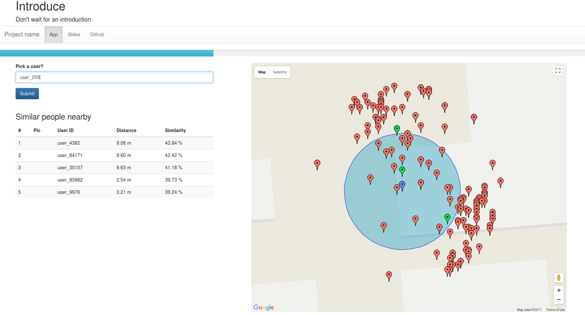
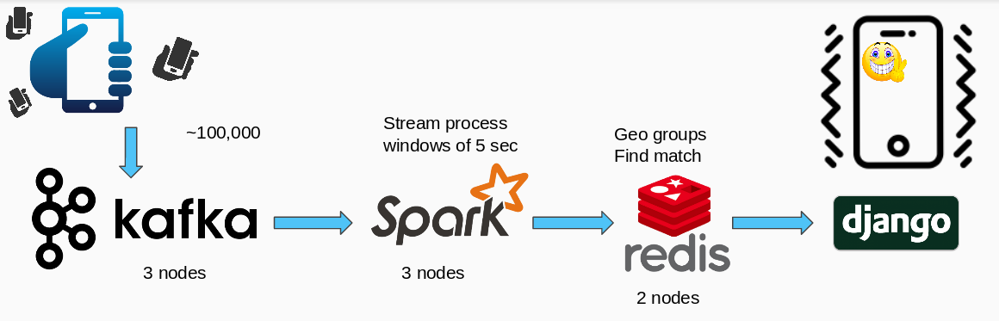

# Introduce - an insight app 

Don't wait for an intorduction!

# Table of Contents
1. [About](README.md#approach)
2. [Pipeline](README.md#pipeline)
3. [Dependencies](README.md#dependencies)
4. [Run Instructions](README.md#run-nstructions)

# About

In this project I implemented the pipeline for an application named Introduce.

The goal of the app is to connect people with same mindset. The challenge is to find the similarities between interests of users when they are nearby eachother. as for data I keep recieve geolocations of users and process them through the pipeline in a way to make sure that queries to find the groups of people and find match suggestions would be as efficeint as possible.

<!--  -->

# Pipeline

As you can see the piple is designed to ingest 100,000 geolocations per 5 second window. This will be processed with spark streaming and aggregated on the latest data in that 5 second window for each user. Then the data is pushed into Redis. Redis uses a geohash method to store GPS coordinations which makes querying nearby users efficient. The result is illustrated in django.

The results of similar matches is represented in a table along with distance and similarity score. This similarity score is calculated by Jaccard similarity coefficient. You can also see the nearby people and similar users on the map.

[Here is the demo.](http://moin.fun/introduce/)

# Dependencies

This project uses python 2.7 for the majority of the backend and HTML and javascript for frontend. Confluent is used to ease the producer process and redis-py to interact with redis.
